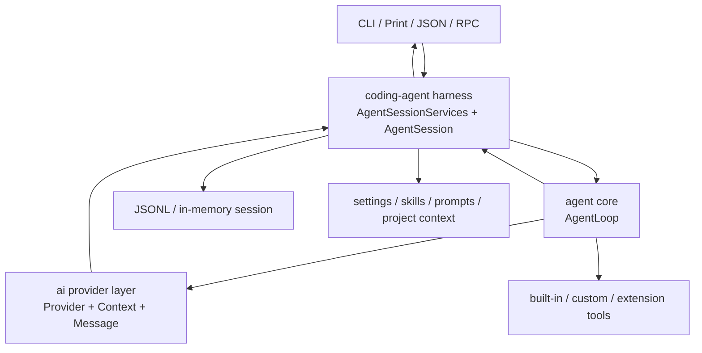
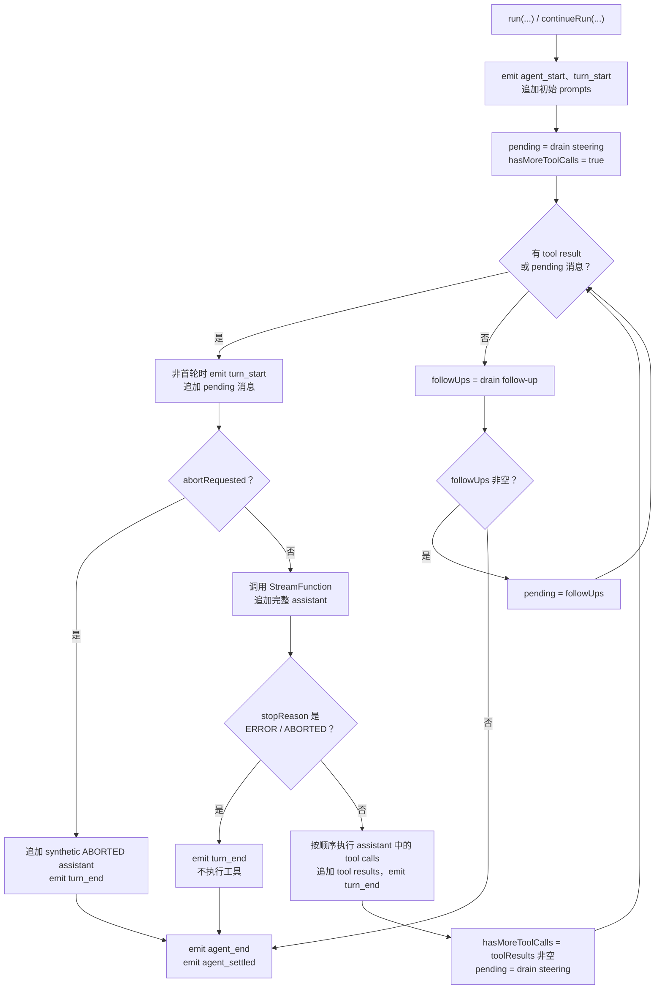
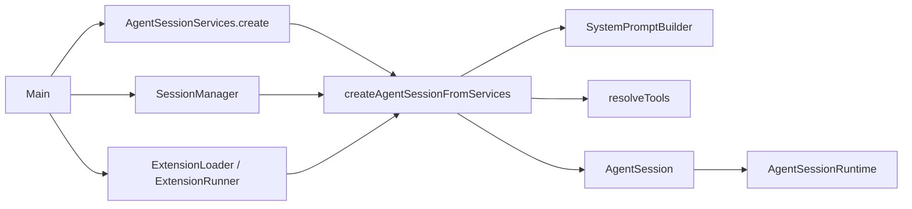
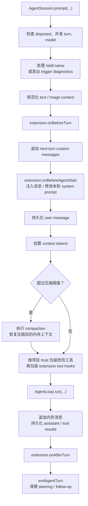
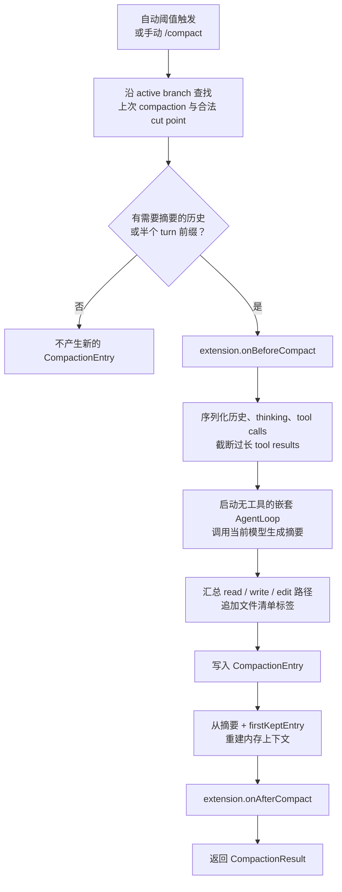
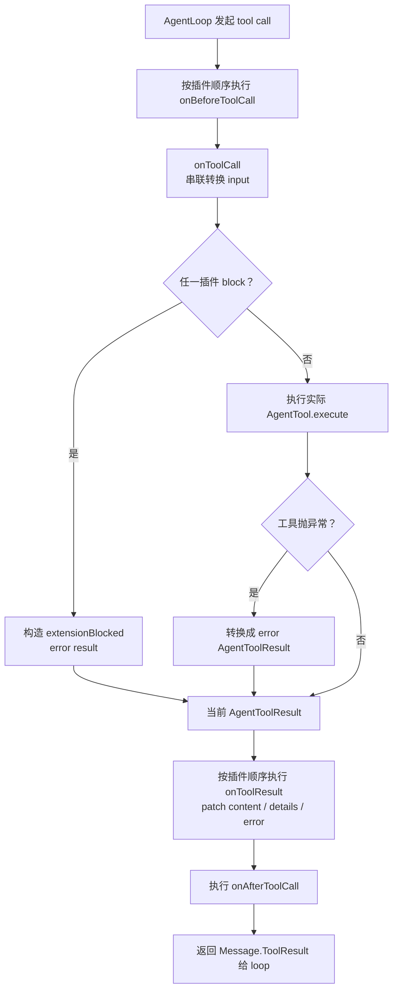

# Agent Loop、Harness 与扩展机制

本文描述 **当前 Java 代码实际执行的链路**，重点回答四个问题：

1. 通用 `AgentLoop` 如何推进“模型 → 工具 → 模型”的循环；
2. `coding-agent` harness 如何把模型、会话、上下文、工具、压缩和 UI 组装起来；
3. 当前有哪些内置工具，它们如何启用、执行和返回结果；
4. 外部代码可以通过哪些 API、SPI 和事件接口扩展系统。

文中的“当前”以仓库内 `packages/agent`、`packages/ai` 和
`packages/coding-agent` 的实现为准。迁移路线图中的计划能力不视为已经实现。

## 1. 分层与职责

Agent 运行时不是一个类完成的，而是分成三层：



| 层 | 主要类 | 当前职责 |
| --- | --- | --- |
| AI 协议层 | `Provider`、`Context`、`Message`、`Content`、`Tool` | 统一模型请求、消息内容块、工具定义和流式事件 |
| 通用 loop | `AgentLoop`、`AgentContext`、`AgentMessage`、`AgentTool`、`AgentEvent` | 推进模型调用、执行工具、注入 steering/follow-up 消息、发出生命周期事件 |
| Coding harness | `AgentSessionServices`、`AgentSession`、`AgentSessionRuntime` | 组装模型与资源、管理会话、持久化、压缩、信任控制、扩展 hook 和 UI 事件 |
| 应用入口 | `Main`、`InteractiveModeRunner`、`PrintModeRunner`、`RpcModeRunner` | 参数解析、选择输出模式、订阅事件并呈现结果 |

`packages/agent` 不知道文件系统工具、CLI、JSONL 会话或扩展 JAR；
这些面向 coding agent 的策略都在 `packages/coding-agent` 中。

## 2. 核心数据模型

### 2.1 `AgentMessage`

Loop 内部使用的消息是一个 sealed interface：

- `AgentMessage.Llm`：包装 `Message.User`、`Message.Assistant` 或
  `Message.ToolResult`，可以直接转换成模型上下文；
- `AgentMessage.Custom`：harness 或扩展产生的自定义消息，包含
  `customType`、`content`、`display` 和 `details`。

通用 loop 默认只把 `Llm` 消息发给模型。Harness 通过
`CodingAgentMessages.convertToLlm(...)` 将以下自定义消息转换成模型可见的
`Message.User`：

- 交互式 `!command` 的 bash 执行记录；
- 分支摘要；
- 压缩摘要；
- 扩展注入的 custom message。

标记为 `excludeFromContext` 的 bash 记录不会进入模型上下文；开启
`images.blockImages` 后，图片内容块会在转换阶段替换为省略说明。

### 2.2 `AgentContext`

`AgentContext` 是值式 record，包含：

```java
record AgentContext(
    List<AgentMessage> messages,
    String systemPrompt,
    List<AgentTool> tools
)
```

每次通过 `append(...)` 追加消息都会复制列表并构造一个新的
`AgentContext`。Record 的公开构造器本身没有对传入列表做 defensive copy，
直接嵌入时应传入不可变列表。调用模型前，
`toLlmContext(...)` 会生成 AI 层的 `Context`，其中包括：

- 已转换的 `List<Message>`；
- system prompt；
- 从 `AgentTool.definition()` 得到的工具 schema；
- thinking level。

当前 `AgentContext.toLlmContext(...)` 将 thinking level 固定为
`ThinkingLevel.OFF`。`AgentSession` 虽然维护和持久化了会话 thinking level，
但这一状态目前没有通过 `AgentContext` 传入模型请求；这是现有实现边界，
不是文档省略。

### 2.3 `AgentTool`

工具需要提供定义和执行器：

```java
public interface AgentTool {
    Tool definition();
    AgentToolResult execute(Object input) throws Exception;
}
```

`Tool` 包含名称、描述、JSON Schema 和可选 prompt guidelines。
`AgentToolResult` 包含：

| 字段 | 作用 |
| --- | --- |
| `content` | 返回给模型的文本、图片等内容块 |
| `details` | 给 UI、日志或调用方使用的结构化细节 |
| `error` | 是否作为失败的 tool result |
| `terminate` | 是否停止执行当前 assistant 消息中剩余的 tool calls |
| `usage` | 工具自身可选的 token/计量信息 |
| `addedToolNames` | 可选的新增工具名称元数据 |

当前 loop 会把 `usage` 和 `addedToolNames` 复制到 `Message.ToolResult`，
但不会根据 `addedToolNames` 动态修改 `AgentContext.tools()`。

接口还声明了 `prepareArguments(...)` 和 `executionMode()`。目前
`AgentLoop.executeToolCalls(...)` 没有调用 `prepareArguments(...)`，也没有按
单个工具的 `executionMode()` 调度；扩展包装器只负责透传这两个方法。

### 2.4 `AgentLoop.Config`

配置项及其语义如下：

| 配置 | 当前语义 |
| --- | --- |
| `model` | 本轮使用的模型 |
| `streamOptions` | API key、transport、timeout、retry、metadata、provider hooks 等 |
| `steeringMessages` | 每个模型/工具 turn 后拉取，需要在下一次模型调用前立即插入的消息 |
| `followUpMessages` | 当前工具链和 steering 都稳定后拉取，用于开启后续 turn |
| `toolExecutionMode` | 声明 `SEQUENTIAL` / `PARALLEL`；当前两者都按列表串行执行 |
| `transformToLlm` | 将完整的 `AgentMessage` 历史投影为模型可见消息 |
| `abortRequested` | 在每次模型请求前检查的协作式取消信号 |

## 3. Agent Loop 的实际执行方式

### 3.1 两个入口

`AgentLoop` 提供两个静态入口：

- `run(prompts, context, config, streamFunction, emit)`：开始一个新调用，
  先把 `prompts` 发出消息事件并追加到上下文；
- `continueRun(context, config, streamFunction, emit)`：从已有上下文继续。
  空上下文会被拒绝，且最后一条消息不能是 assistant。

两个入口都只返回本次调用新增的消息，不返回传入的完整历史。

### 3.2 状态机



核心逻辑可以近似写成：

```text
emit agent_start
emit turn_start
append initial prompts
pending = drain steering

while true:
    while previous assistant produced tool results OR pending is not empty:
        append pending

        if abort requested:
            append synthetic "Operation aborted." assistant
            emit terminal events
            return

        assistant = stream(model, transformed context, options)
        append assistant

        if assistant stop reason is ERROR or ABORTED:
            emit terminal events
            return

        toolResults = execute every tool call in assistant content
        append toolResults
        emit turn_end

        pending = drain steering

    followUps = drain follow-up
    if followUps is not empty:
        pending = followUps
        continue
    break

emit agent_end
emit agent_settled
```

关键点是：是否继续 loop 由“是否产生了 tool result”决定，而不是只看
`StopReason.TOOL_USE`。因此：

- assistant 内容里有 tool call 时，即使 stop reason 不是 `TOOL_USE`，仍会执行；
- stop reason 是 `TOOL_USE` 但没有 tool call 时，loop 会稳定并结束；
- `ERROR` 和 `ABORTED` 会在执行工具前终止。

### 3.3 一个工具调用 turn 的时序

```mermaid
sequenceDiagram
    participant User as "Prompt caller"
    participant Session as "AgentSession"
    participant Loop as "AgentLoop"
    participant Provider as "Provider"
    participant Tool as "AgentTool"
    participant Store as "SessionManager"

    User->>Session: prompt(...)
    Session->>Store: append user message
    Session->>Loop: run(prompt, context, config)
    Loop->>Provider: stream(model, context, options)
    Provider-->>Session: ContentDelta events
    Provider-->>Loop: completed Assistant with ToolCall
    Loop->>Tool: execute(converted input)
    Tool-->>Loop: AgentToolResult
    Loop->>Provider: stream(context + assistant + tool result)
    Provider-->>Loop: completed final Assistant
    Loop-->>Session: new messages
    Session->>Store: append assistant/tool-result messages
    Session-->>User: result + events
```

Provider 的增量内容由 `AgentSession.awaitProviderStream(...)` 订阅并转成
`AgentEvent.MessageUpdate`。通用 `AgentLoop` 本身拿到的是已经完成的
`Message.Assistant`，所以当前事件顺序可能是：

1. 若干 `message_update`；
2. assistant 的 `message_start`；
3. assistant 的 `message_end`。

这与“先 start、再 delta、最后 end”的典型流式协议不同，外部订阅者应按
当前顺序处理。

### 3.4 工具查找、参数和错误

每个 assistant 消息中的 `Content.ToolCall` 按出现顺序处理：

1. 将上下文工具按名称放入 map；同名工具后者覆盖前者；
2. 发出 `tool_execution_start`，其中 `args` 仍是原始 `JsonNode`；
3. 将 JSON 递归转换为 Java `Map`、`List`、`String`、`Number`、
   `Boolean` 或 `null`；
4. 按名称查找工具并调用 `execute(...)`；
5. 工具不存在或执行器抛异常时，转换成 `error=true` 的文本结果；
6. 发出 `tool_execution_end`，再为 tool result 发出
   `message_start` / `message_end`；
7. 将结果追加到上下文，供下一次模型请求观察。

Loop 不额外执行 JSON Schema 校验，参数校验由具体工具完成。

`terminate=true` 只会中断当前 assistant 消息中后续 tool calls；已经产生的
tool result 仍会触发下一次模型调用。它目前不是“立即结束整个 agent”的信号。

### 3.5 Steering、follow-up 和 next-turn

Harness 维护三类队列：

| 队列 | 消费时机 | 用途 |
| --- | --- | --- |
| steering | loop 启动时，以及每个模型/工具 turn 结束后 | 尽快改变正在进行的任务方向 |
| follow-up | 当前工具链和 steering 队列都稳定后 | 在同一次 `AgentLoop.run(...)` 中追加一个后续用户 turn |
| next-turn | 下次普通用户 prompt 开始前 | 扩展预先注入但暂不触发模型的 custom message |

运行中调用 `sendUserMessage(...)` 必须显式指定 `STEER` 或 `FOLLOW_UP`；
空闲时则会直接开始一个新 prompt。队列变化通过 `queue_update` 对外广播。

队列当前基于 `ArrayList`，loop 以 supplier 方式拉取；实现没有额外的并发队列
或锁语义，调用方不应假设任意多线程并发写入已经得到保证。

### 3.6 取消与异常边界

`AgentSession.abort()` 会设置布尔标记并完成 `abortSignal` future。Loop 在
**下一次模型请求之前**读取该标记，然后生成一个
`StopReason.ABORTED` 的 synthetic assistant。

当前取消不会直接：

- 中断已经发出的 provider HTTP/stream 请求；
- 杀掉正在执行的 tool；
- 终止正在执行的交互式 bash 进程。

Provider 调用由 harness 做超时和重试。若最终仍抛异常，
`AgentLoop.runLoop(...)` 不捕获该异常，因此调用者会收到异常，且 loop 不会补发
`agent_end` / `agent_settled`。与此不同，工具异常会转换成正常的 error tool result，
让模型有机会继续处理。

## 4. 事件模型与可观测性

`AgentEvent` 当前包含：

| 事件 | 载荷/时机 |
| --- | --- |
| `agent_start` | 一次 `run` / `continueRun` 开始 |
| `turn_start` | 每次准备追加 pending 消息并调用模型 |
| `message_start` | prompt、完整 assistant 或 tool result 开始 |
| `message_update` | provider 流式内容增量；由 harness 补充 |
| `message_end` | 一条完整消息结束 |
| `tool_execution_start` | tool call id、名称、原始参数 |
| `tool_execution_update` | 预留部分结果事件；内置 loop 当前不发出 |
| `tool_execution_end` | 最终 `AgentToolResult` 和 error 标记 |
| `turn_end` | assistant 和本 turn 的全部 tool results |
| `agent_end` | 本次新增消息 |
| `agent_settled` | 紧跟 `agent_end` 发出，表示当前调用稳定 |

`AgentSession` 将这些事件包装为 `AgentSessionEvent.AgentEventEnvelope`，
并额外发出队列变化、thinking level、会话信息、skill 命令、skill 触发诊断和
disposed 事件。交互、print/JSON 和 RPC 层可以订阅同一 session 事件源，
再选择各自的呈现格式。

当前 `agent_end` 与 `agent_settled` 之间没有异步清理阶段，两者连续发出。
`tool_execution_update` 也尚未接入内置工具的流式输出；bash tool 只在完成后
返回一个最终结果。

## 5. Coding Harness 的组装过程

### 5.1 启动链路

CLI 启动时的关键链路如下：



`AgentSessionServices.create(...)` 负责：

- 规范化 cwd 和 agent directory；
- 创建或复用 `AuthStorage`、`SettingsManager`、`ProviderRegistry`、
  `ModelRegistry`；
- 创建 `ResourceLoader` 并加载 settings、skills、prompt templates、
  themes、system prompt 与项目上下文。

`createAgentSessionFromServices(...)` 随后：

1. 解析初始模型和 thinking level；
2. 调用扩展的资源发现 hook；
3. 选择内置工具并合并 custom/extension tools；
4. 根据工具定义、资源和 cwd 构建 system prompt；
5. 创建 `AgentSession`；
6. 从当前 JSONL 分支恢复内存消息。

### 5.2 每次 prompt 的 harness 前后处理

下图表示正常完成路径；任一步抛异常时，`finally` 仍会结束 active turn 并清理
steering/follow-up 队列。



`AgentSession.prompt(...)` 在进入 loop 前会：

1. 拒绝 disposed session、并发的新 prompt 或未选择模型的请求；
2. 解析显式 `/skill:name`，或发出 skill trigger diagnostics；
3. 将文本和图片规范化为 user content；
4. 执行扩展 `onBeforeTurn`；
5. 追加 next-turn custom messages；
6. 执行 `onBeforeAgentStart`，允许注入消息或替换本 turn 的 system prompt；
7. 先把 user message 持久化到 session；
8. 估算上下文，必要时自动压缩；
9. 根据项目信任状态包装危险工具；
10. 通过 `AgentLoop.run(...)` 执行；
11. 持久化本次新增的 assistant 和 tool-result 消息；
12. 执行 `onAfterTurn`。

扩展修改的 system prompt 只作用于当前 turn，不会覆盖 session 构造时的基础
`systemPrompt` 字段。

### 5.3 System prompt

默认 system prompt 由 `SystemPromptBuilder` 拼装：

- coding assistant 基础角色；
- 当前实际启用的工具名称与描述；
- 工具提供的 `promptGuidelines`；
- README、docs、examples 的导航提示；
- settings 或资源包追加的 system prompt；
- 项目 context files；
- 当 `read` 可用时，模型可见的 skill 描述；
- 当前 cwd。

如果资源提供了完整 custom system prompt，则以 custom prompt 为基础，但仍会
追加 append prompt、项目 context、skill 描述和 cwd。

Skill 的 trigger hints 当前用于诊断匹配；普通 prompt 命中 trigger
不会自动把整个 `SKILL.md` 正文注入上下文。显式 `/skill:name` 才会展开正文。

### 5.4 Provider 调用

未注入自定义 `AgentLoop.StreamFunction` 时，`AgentSession` 会：

1. 按 `model.provider()` 查找 provider；找不到时，若 `model.api()` 非空则按
   API 类型查找，否则查找 `openai` id；
2. 从 `StreamOptions` 或 `ModelRegistry` 补齐 API key；
3. 合并 provider request/response extension hooks；
4. 调用 `Provider.stream(...)`；
5. 订阅所有流事件，将 `ContentDelta` 转为 `message_update`；
6. 等待 terminal `End` 或 `Error`；
7. 对可重试错误执行 `AssistantCallRetry`；
8. 返回最终 `Message.Assistant` 给 `AgentLoop`。

等待时长是配置 timeout 加 5 秒；timeout 为 `null` 时使用 120 秒。
标准 `StreamOptions.defaults()` 的 timeout 是 10 分钟，所以默认组装路径实际
等待上限约为 10 分 5 秒。
Retry 次数默认 2，初始延迟默认 250ms，最大延迟默认 4s，并可由 settings
写入 `StreamOptions.metadata` 覆盖。

### 5.5 会话与持久化

`SessionManager` 支持 JSONL 和内存两种存储。JSONL 当前版本为 3，
每个 entry 通过 `id` / `parentId` 形成分支树。Entry 类型包括：

- message；
- model / thinking level / active tools change；
- compaction / branch summary；
- custom / custom message；
- label / session info / leaf。

User message 在 loop 前写入；assistant 和 tool result 在 loop 完成后批量写入。
因此若 provider 调用最终抛异常，user message仍可能已经持久化，而本次未完成的
assistant 不会写入。

`AgentSessionRuntime` 负责切换、创建、fork、导入和 reload session。
切换时会 dispose 旧 session、重建 resources/session，再让 UI 重新绑定。
扩展可以在 switch 或 fork 前取消操作。

### 5.6 上下文压缩



自动压缩在 user message 入库后、进入主 loop 前检查：

- 优先使用最后一条有效 assistant usage 作为已有上下文 token 数；
- 对该 assistant 之后的消息使用约 `字符数 / 4` 的估算；
- 图片按 4,800 字符估算；
- 达到 `contextWindow - reserveTokens` 时触发。

当前 `AgentSession` 的自动参数是：

```text
enabled = true
reserveTokens = 16,384
keepRecentTokens = 10
```

注意这里的 `keepRecentTokens=10` 是当前代码中的实际值，不是
`CompactionSupport.DEFAULT_SETTINGS` 的 20,000。手动 `/compact` 使用
`reserveTokens=0`、`keepRecentTokens=0`。

压缩过程会：

1. 沿当前 session branch 找上次 compaction 和合法 cut point；
2. 区分完整历史、需要保留摘要的半个 turn 前缀和近期消息；
3. 序列化 user、assistant thinking/text/tool calls 和截断后的 tool results；
4. 用当前模型发起一个无工具的独立 `AgentLoop.run(...)` 生成摘要；
5. 从 assistant tool calls 中提取 read/write/edit 路径；
6. 在摘要末尾追加 `<read-files>` 和 `<modified-files>`；
7. 写入 `CompactionEntry`；
8. 从最新 compaction + first kept entry 重建内存上下文；
9. 发出扩展 before/after compact hooks。

因为摘要生成复用了 `AgentLoop.run(...)` 和同一个事件处理器，事件订阅者会看到
一组额外的 `agent_start` / `turn_start` / `agent_end` 事件。

### 5.7 `packages/agent/harness` 的位置

`packages/agent/harness` 目前还有通用的 `Compaction` 和 `FileOperations`
helper，但主 coding session 没有引用这两个类。实际自动/手动压缩走的是
`packages/coding-agent` 的 `CompactionSupport`。因此前者目前是可复用基础件，
不是 coding harness 主链路的另一层自动处理。

### 5.8 信任控制与路径边界

若项目包含需要信任的 `.pi` 或 `.agents/skills` 资源，且 trust store 明确记录
该项目不可信，harness 会把名为 `bash`、`write`、`edit` 的工具替换成拒绝执行的
包装器。

这不是操作系统级 sandbox：

- `PathUtils.resolveInside(...)` 当前只做解析与 normalize，没有验证结果必须位于 cwd；
- absolute path 和 `..` 可以解析到 cwd 之外；
- `read`、扩展工具和其他自定义工具不受上述三个名称的 guard 保护；
- 工具代码与主进程拥有相同的 JVM/OS 权限。

因此嵌入方如果面对不可信模型、用户或扩展，仍需在进程、容器、文件系统和网络层
提供真正的隔离。

## 6. 内置工具列表

`CodingToolFactory.ToolName` 当前定义 7 个工具：

| 工具 | 主要参数 | 行为与结果 |
| --- | --- | --- |
| `read` | `path`，可选 `limit` | 读取 UTF-8 文本；或返回 jpg/png/gif/webp/bmp 图片附件。文本按行数/字节数截断，图片可按 settings 自动缩放 |
| `bash` | `command`，可选 `timeout` 秒 | 使用配置 shell 在 cwd 执行，合并 stdout/stderr；非 0 exit code 标记 error；长输出保留尾部并写到临时文件，但 tool result details 当前没有暴露该临时路径 |
| `edit` | `path`，`edits[]`；兼容 `oldText` / `newText` | 对原文件做一个或多个精确替换；每个 old text 必须唯一，编辑之间不能重叠；保留原换行符并返回 unified diff |
| `write` | `path`、`content`，可选 `overwrite` | 创建父目录并写文件；`overwrite` 默认 true；返回 created、bytes 和 unified diff |
| `grep` | `pattern` | 在 cwd 下按正则搜索内容；优先使用 `rg`，否则 Java 遍历；当前 schema 不暴露 path/include，固定搜索 `**/*` |
| `find` | `pattern`，可选 `path`；执行器也接受 `limit` | 查找文件；优先使用 `fd`，否则 glob 遍历；忽略 `.git` 和 `node_modules`，默认最多 1,000 条 |
| `ls` | 可选 `path` | 列出单层目录，目录排在文件前并追加 `/` |

### 6.1 默认启用规则

CLI 默认启用：

```text
read, bash, edit, write
```

`grep`、`find` 和 `ls` 已实现但默认不启用，因为默认 system prompt 引导模型通过
`bash` 使用 `rg`、`find`、`ls`。

工具选择顺序为：

1. 若传入 allow list（CLI `--tools`），只从内置工具中选择这些名称；
2. 否则启用默认四个内置工具；
3. 加入 programmatic custom tools 和 extension tools；
4. 应用 exclude list；
5. 同名 custom/extension tool 覆盖已选择的内置工具。

当前 CLI `--no-tools` 会跳过内置工具，但随后仍会加入 extension/custom tools。
因此它在现有实现中更接近“禁用 built-ins”，并不保证 session 的最终工具列表为空。

### 6.2 文件修改一致性

`write` 和 `edit` 通过 `FileMutationQueue` 以规范化文件路径为 key 加锁，
同一 JVM 内对同一文件的修改会串行执行。它不提供：

- 跨进程锁；
- 写前内容版本校验；
- 全局事务或多文件原子性；
- cwd 边界检查。

## 7. 对外扩展面

当前有五类主要扩展入口：

| 扩展面 | 入口 | 适用场景 |
| --- | --- | --- |
| 模型调用 | `AgentLoop.StreamFunction` | 测试 fake model、代理、自定义模型路由 |
| 工具 | 实现 `AgentTool`，通过 `customTools` 注入 | 应用内强类型工具 |
| Provider | 实现并注册 `Provider` | 新的模型供应商或协议 |
| 消息/事件 | `transformToLlm`、`Consumer<AgentEvent>`、`AgentSession.subscribe` | 自定义上下文投影、日志、UI、遥测 |
| JAR 扩展 | `ExtensionPlugin` + Java `ServiceLoader` | 可分发的工具、命令、资源和生命周期 hook |

### 7.1 直接嵌入 `AgentLoop`

最小嵌入需要上下文、工具、stream function 和事件 consumer：

```java
AgentTool echo = new AgentTool() {
    @Override
    public Tool definition() {
        return new Tool(
                "echo",
                "Echo text",
                JsonCodec.parse("""
                    {
                      "type": "object",
                      "properties": {"text": {"type": "string"}},
                      "required": ["text"]
                    }
                    """),
                null);
    }

    @Override
    public AgentToolResult execute(Object input) {
        return new AgentToolResult(
                List.of(new Content.Text(String.valueOf(input))),
                null,
                false,
                false);
    }
};

AgentContext context = new AgentContext(
        List.of(),
        "You are a small embedded agent.",
        List.of(echo));

List<AgentMessage> result = AgentLoop.run(
        List.of(new AgentMessage.Llm(
                new Message.User(List.of(new Content.Text("hello")), Instant.now()))),
        context,
        new AgentLoop.Config(
                model,
                StreamOptions.defaults(),
                List::of,
                List::of,
                AgentLoop.ToolExecutionMode.SEQUENTIAL),
        myStreamFunction,
        event -> eventSink.accept(event));
```

嵌入方负责提供 `Model`、真正的 `StreamFunction`、会话保存、重试和安全策略。
如果希望复用完整 coding harness，应通过 `AgentSessionServices` /
`createAgentSessionFromServices(...)` 创建 `AgentSession`。

### 7.2 通过完整 harness 注入

若应用希望保留 session、system prompt、compaction 和 extension hooks，同时
加入自己的能力，可以在创建服务/session 时注入：

- `AgentSessionServices.CreateOptions.providerRegistry`：传入已经注册自定义
  `Provider` 的 `ProviderRegistry`；
- `CreateSessionOptions.customTools`：加入应用内 `AgentTool`；
- `CreateSessionOptions.streamFunction`：完全替换默认 provider 调用，常用于测试、
  网关或进程外模型执行器；
- `CreateSessionOptions.extensionRunner`：直接传入已经构造的插件集合；
- `CreateOptions.resourceLoader`、`settingsManager`、`authStorage`、
  `modelRegistry`：替换对应 harness service。

自定义 Provider 的核心注册方式是：

```java
ProviderRegistry providers = new ProviderRegistry();
providers.registerDefaults();
providers.register(new MyProvider());

AgentSessionServices services = AgentSessionServices.create(
        new AgentSessionServices.CreateOptions(
                cwd,
                agentDir,
                null,
                null,
                null,
                providers,
                null,
                true));
```

同 id 的 Provider 后注册者覆盖先注册者。Provider 仍需返回统一的
`AssistantMessageEventStream`，这样 harness 才能复用 delta 事件、terminal
message、timeout 和 retry 逻辑。

### 7.3 JAR 扩展发现

`ExtensionLoader` 使用 `ServiceLoader<ExtensionPlugin>`，发现顺序为：

1. 当前 classpath 上的 SPI provider；
2. `~/.pi/agent/extensions` 下的直接子 `.jar`；
3. `<cwd>/.pi/extensions` 下的直接子 `.jar`；
4. settings 的 `extensions` 路径；
5. CLI `-e` / `--extension` 指定的 JAR 或目录。

目录只扫描一层，不递归。相对显式路径以 cwd 解析。

`--no-extensions` 禁用 classpath、用户目录、项目目录和 settings 路径；
若同时显式传入 `--extension`，显式路径仍会加载。

扩展 JAR 必须包含 SPI 文件：

```text
META-INF/services/works.earendil.pi.codingagent.core.extensions.ExtensionPlugin
```

文件内容为实现类的全限定名，例如：

```text
com.example.pi.AuditExtension
```

### 7.4 `ExtensionPlugin` 能力

| 能力 | 方法 | 当前接入位置 |
| --- | --- | --- |
| 工具 | `registerTools`、`executeTool` | 创建 session 时加入 custom tools |
| Slash command | `registerCommands`、`executeCommand` | 交互模式帮助和命令分发 |
| Flag 元数据 | `registerFlags` | Runner 可收集；当前未接入 Picocli 的二阶段参数解析 |
| 输入过滤 | `onInput` | 交互模式普通输入进入内置命令解析前 |
| 用户 bash | `onUserBash` | `!` / `!!` 或 `AgentSession.executeBash` |
| Turn | `onBeforeTurn`、`onBeforeAgentStart`、`onAfterTurn` | 普通 prompt 前后 |
| 工具拦截 | `onBeforeToolCall`、`onToolCall`、`onToolResult`、`onAfterToolCall` | 所有 active tools 外层包装 |
| Provider | `onBeforeProviderRequest`、`onAfterProviderResponse` | provider 协议请求/响应 |
| Compaction | `onBeforeCompact`、`onAfterCompact` | 自动和手动压缩 |
| Session | `onSessionBeforeSwitch`、`onSessionBeforeFork` | session 替换/fork 前，可取消 |
| 动态资源 | `onResourcesDiscover` | session 创建或 reload 时追加 skill/prompt/theme 路径 |

`onBeforeAgentStart` 可以顺序修改本 turn system prompt，并追加一个或多个
custom messages。多个插件按加载顺序串联：前一个修改后的 system prompt 会传给
下一个。

工具拦截流水线是：



若某个插件 block，真实工具不会运行，但 block result 仍会经过所有插件的
`onToolResult`。

### 7.5 最小 JAR 扩展示例

```java
package com.example.pi;

import works.earendil.pi.agent.core.AgentTool;
import works.earendil.pi.ai.model.Content;
import works.earendil.pi.ai.model.Tool;
import works.earendil.pi.codingagent.core.extensions.ExtensionPlugin;
import works.earendil.pi.common.json.JsonCodec;

import java.util.List;
import java.util.Map;

public final class AuditExtension implements ExtensionPlugin {
    @Override
    public String name() {
        return "audit-extension";
    }

    @Override
    public List<Tool> registerTools() {
        return List.of(new Tool(
                "audit_note",
                "Record an audit note",
                JsonCodec.parse("""
                    {
                      "type": "object",
                      "properties": {"text": {"type": "string"}},
                      "required": ["text"]
                    }
                    """),
                "Use only when the user asks to record an audit note."));
    }

    @Override
    public AgentTool.AgentToolResult executeTool(String toolName, Object input) {
        if (!"audit_note".equals(toolName)) {
            return null;
        }
        return new AgentTool.AgentToolResult(
                List.of(new Content.Text("Audit note recorded.")),
                Map.of("input", input),
                false,
                false);
    }
}
```

加载方式任选一种：

```bash
pi --extension /absolute/path/audit-extension.jar
```

或写入 settings：

```json
{
  "extensions": [
    "/absolute/path/audit-extension.jar"
  ]
}
```

扩展需要以 `pi-coding-agent` 和相关 core artifacts 作为编译依赖，并与运行中的
SPI 二进制接口保持兼容。

### 7.6 `ExtensionCommandContext`

命令和 hook 可以通过 context 获取：

- cwd、session id/file/name 和 session stats；
- `argv`、`--option value`、`--option=value`、flags、positionals；
- UI mode（`tui`、`rpc`、`json`、`print`）与 terminal size；
- idle/pending/abort 状态；
- 设置 session name、entry label、追加 custom entry；
- 发送 user message（steer/follow-up）；
- 发送 custom message（steer/follow-up/next-turn）；
- 请求 abort。

只有带真实 `AgentSession` 的 context 才能使用 session 相关能力。
资源发现阶段使用的 cwd-only context 无法发送消息。

### 7.7 扩展冲突与失败策略

当前策略需要扩展作者特别注意：

- 同名 extension tool 在 session 工具 map 中由后加入者覆盖；
- extension tool 也可以覆盖同名 built-in；
- extension command 采用 first-wins，且不能覆盖 built-in command 或
  `help`、`exit`、`quit`、`clear`；
- 插件返回非空 `ToolResultPatch` 后，当前 runner 会重建
  `AgentToolResult`，但不会保留原结果的 `usage` 和 `addedToolNames`；
- 大多数插件注册和 hook 异常会被 `ExtensionRunner` 静默忽略；
- JAR 扫描/加载异常也被 loader 忽略，当前没有统一诊断事件；
- `executeCommand(...)` 的异常会由交互层显示为 command error；
- `executeTool(...)` 未实现并返回 `null` 时，会产生明确的 error tool result。

扩展与主进程同权限运行，不是隔离插件。生产环境应只加载可信 JAR。

## 8. 当前并发和“并行工具”语义

`AgentLoop.ToolExecutionMode` 和 `AgentTool.ExecutionMode` 已经定义了并行相关 API，
但当前实现仍在普通 `for` 循环中逐个调用工具：

- `SEQUENTIAL` 串行；
- `PARALLEL` 也串行；
- 单个 `AgentTool.executionMode()` 不参与调度；
- `prepareArguments(...)` 不参与执行；
- `tool_execution_update` 不会由 loop 自动发出。

因此文档和调用方不应将 `PARALLEL` 理解为已经使用线程池或 structured
concurrency。若后续实现真正并行，需要同时明确：

- tool result 的稳定排序；
- `terminate` 对其他已启动任务的取消语义；
- 同名文件写入的互斥；
- extension hook 的线程安全；
- steering/abort 与执行中工具的交互。

## 9. 代码导航

| 主题 | 代码位置 |
| --- | --- |
| Loop 状态机 | `packages/agent/src/main/java/works/earendil/pi/agent/core/AgentLoop.java` |
| 上下文、消息、工具、事件 | `packages/agent/src/main/java/works/earendil/pi/agent/core/` |
| Agent 层 compaction/file harness 基础件 | `packages/agent/src/main/java/works/earendil/pi/agent/harness/` |
| Coding session 主流程 | `packages/coding-agent/src/main/java/works/earendil/pi/codingagent/core/AgentSession.java` |
| Harness 组装 | `packages/coding-agent/src/main/java/works/earendil/pi/codingagent/core/AgentSessionServices.java` |
| Session 切换/reload/fork | `packages/coding-agent/src/main/java/works/earendil/pi/codingagent/core/AgentSessionRuntime.java` |
| 上下文压缩 | `packages/coding-agent/src/main/java/works/earendil/pi/codingagent/core/CompactionSupport.java` |
| System prompt | `packages/coding-agent/src/main/java/works/earendil/pi/codingagent/core/SystemPromptBuilder.java` |
| 内置工具 | `packages/coding-agent/src/main/java/works/earendil/pi/codingagent/tools/` |
| 扩展 SPI | `packages/coding-agent/src/main/java/works/earendil/pi/codingagent/core/extensions/` |
| CLI 启动与扩展加载 | `packages/coding-agent/src/main/java/works/earendil/pi/codingagent/cli/Main.java` |
| 会话持久化 | `packages/coding-agent/src/main/java/works/earendil/pi/codingagent/session/SessionManager.java` |
| Loop 单测 | `packages/agent/src/test/java/works/earendil/pi/agent/core/AgentLoopTest.java` |
| Harness/扩展集成单测 | `packages/coding-agent/src/test/java/works/earendil/pi/codingagent/core/AgentSessionRuntimeTest.java` |
| 工具单测 | `packages/coding-agent/src/test/java/works/earendil/pi/codingagent/tools/CodingToolFactoryTest.java` |

## 10. 已知实现边界汇总

为避免将设计接口误写成完成能力，当前需要保留以下认知：

- tool execution mode 尚未实现真正并行；
- thinking level 尚未从 `AgentSession` 传入 `AgentContext` 的模型请求；
- abort 是 turn 边界的协作式检查，不会取消执行中的 provider/tool；
- provider 最终异常不会自动补发 agent terminal events；
- `tool_execution_update` 目前没有内置生产者；
- `AgentTool.prepareArguments()`、单工具 `executionMode()` 和动态
  `addedToolNames` 尚未接入 loop 调度；
- `--no-tools` 仍可能保留 extension/custom tools；
- 路径解析不等于 cwd sandbox；
- extension flags 只可收集，尚未加入 Picocli 参数解析；
- package manifest 中的 `extensions` 资源仍是预留数据，当前运行时只执行
  classpath 或路径发现到的 Java JAR extension；
- extension loader/runner 对多数错误采用静默忽略；
- 自动 compaction 的 `keepRecentTokens` 当前是 10；
- 普通 skill trigger 只产生 diagnostics，不自动展开完整 skill 正文。

这些条目是理解当前行为和设计下一步兼容改动时的基线。
