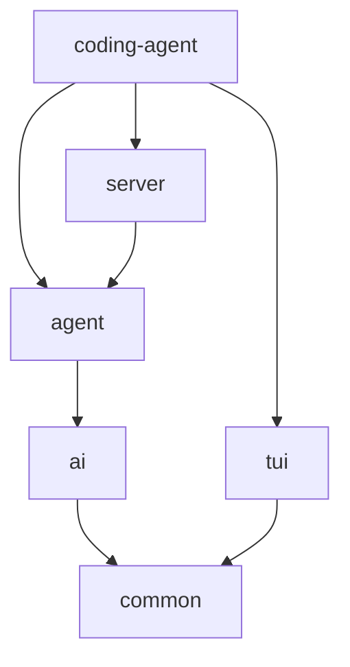

# 架构设计 (Architecture)

**pi-java** 被设计为一个高度模块化的 Maven monorepo（单体仓库），以清晰的代码边界分离核心逻辑、AI 交互、智能体执行与用户界面。

## 模块总览

在 `packages` 目录下，包含以下主要模块，它们自底向上构成了整个 Agent 生态：

### 1. `packages/common`
**核心基石**
包含整个系统依赖的基础工具库、共享的 Java 接口（Interfaces）以及公共的数据模型（Data Models）。它是不包含特定业务逻辑的底层支撑模块。

### 2. `packages/ai`
**AI 提供商集成**
该模块抽象了所有与大语言模型 (LLM) 相关的交互。它负责：
- 封装不同模型提供商（如 Bedrock, OpenAI, Anthropic, Groq 等）的 API。
- 处理特定提供商的高级协议，如 AWS Bedrock 的 Converse Request、Claude 的 thinking signature 等。
- 提供分词工具 (Tokenization utilities)。

### 3. `packages/agent`
**智能体核心逻辑**
处理智能体（Agent）运行的基础设施，包括：
- 核心 Agent Loop (思考 -> 动作 -> 观察)。
- 通用消息、上下文、工具与生命周期事件协议。
- steering / follow-up 队列消费、工具结果回填和协作式取消边界。

`packages/agent` 本身不包含 coding assistant 的文件工具、完整提示词组装或
JSONL 会话策略。这些 harness 能力由 `packages/coding-agent` 基于核心 loop
组合实现。

### 4. `packages/tui`
**终端用户界面 (Terminal User Interface)**
基于 `JLine3` 框架打造的现代终端界面模块：
- 封装了丰富的终端组件，如 `ListSelector` 等全屏组件。
- 处理用户的键盘交互，支持复杂的多重选择和终端内容渲染。

### 5. `packages/coding-agent`
**代码助手核心实现**
基于上述模块构建的专业应用，专为理解代码库、编辑文件以及执行软件工程工作流而设计：
- 实现用于工程任务的专属工具组（读文件、写代码、运行终端命令等）。
- 负责模型、system prompt、项目资源、会话持久化、上下文压缩、信任控制和扩展 hook 的组装。
- 包管理器 (`PackageManager`)，处理 `pi install` 依赖管理以及基于全局/项目的环境隔离。
- 提供各种 Slash Commands (`/theme`, `/prompt`, `/goal` 等) 的 CLI 交互入口。

### 6. `packages/server`
**多智能体编排系统**
复杂的任务通常不是单一个体能够完成的。该模块负责：
- **子智能体 (Sub-agents)** 角色的定义与委托。
- 多 Agent 的状态协同，提供团队协作（`/teamwork-preview`）。
- 控制实例重试、后台日志监控与心跳保活。

## 依赖关系

依赖方向始终是**单向**的，高级业务模块依赖底层抽象模块：

这种模块化设计保证了 `pi-java` 可以在未来轻松被拆分，或者将底层的 `ai` 和 `agent` 引擎复用到其他的独立项目中。

Agent Loop 的逐步执行、harness 组装、内置工具和 JAR SPI 扩展接口详见
**[Agent Loop、Harness 与扩展机制](agent-loop-and-harness.md)**。
