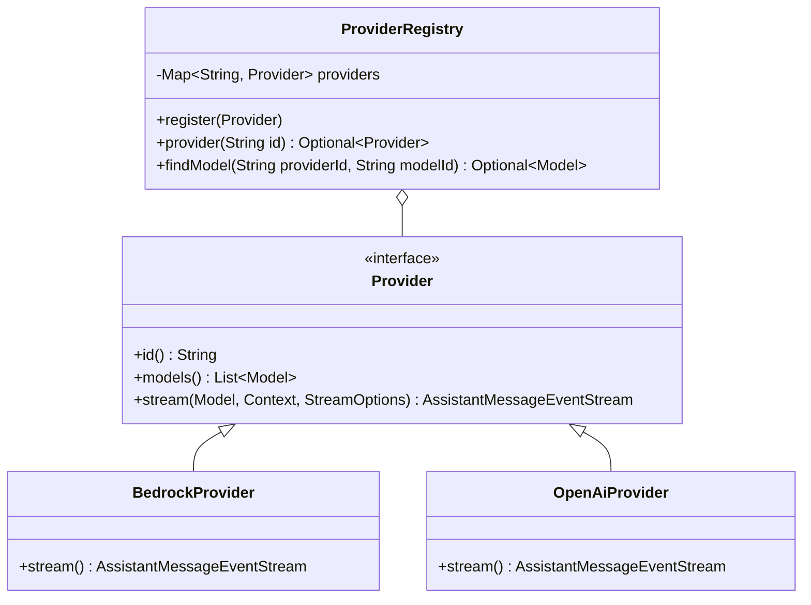
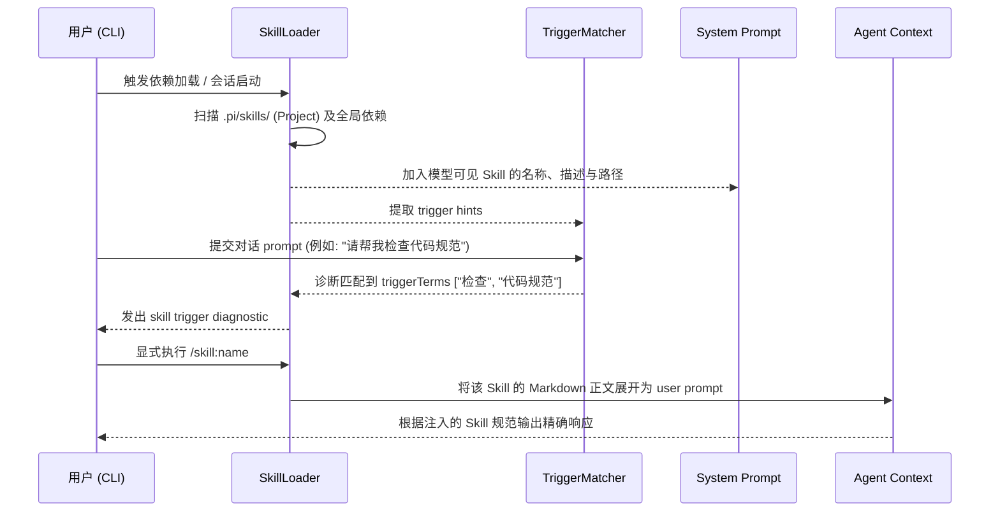

# 亮点设计 (Design Highlights)

在将 `pi` 从原有的 TypeScript 单体仓库演进到基于 Java 21 的 `pi-java` 生产级仓库过程中，我们并没有进行简单的代码翻译，而是基于 Java 的生态优势，对多个核心子系统进行了深刻的设计重构。

以下是 `pi-java` 的关键亮点设计：

## 1. SPI-based Extension Ecosystem (基于 JAR SPI 的扩展系统)

原有的 TypeScript 版本依赖 Node.js 动态的脚本运行环境（如动态 `require` 或 `import`）来实现扩展（Extension）生态。

在 Java 中，我们选择了一条类型安全且更为高效的道路：**JAR SPI (Service Provider Interface)**。
- 所有的扩展工具（Tools）、事件生命周期（Event Hooks）、命令解析（Commands）以及基础 UI context，均通过标准的 Java SPI 进行注册与加载。
- 这种设计不仅杜绝了动态脚本加载带来的安全隐患与内存泄漏，还在运行时带来了显著的性能提升。
- 我们利用 `before_agent_start` 等生命周期钩子，成功复刻了旧版的 steer/followUp 队列语义，并能在保持严格强类型的同时，实现与旧版插件系统的底层架构兼容。

## 2. Settings-driven Package Management (配置驱动的包管理)

作为一个 Agent 框架，`pi-java` 高度重视**工具（Skills）**和**表现（Themes/Prompts）**的共享与复用。

- **多来源支持**：包资源发现 (`PackageResourceResolver`) 支持从全局/可信项目安装目录加载 `package.json` 或常规目录（如 `skills/`, `themes/`）。
- **细粒度信任控制 (Trust Scoping)**：对象形式的 package filters（如通过 `pi config list|enable|disable` 调节）能够精确作用于 global 或是 project 作用域。当在不同的可信项目（trusted project）间切换时，包管理系统（PackageManager）会自动隔离并聚合资源，避免安全越权。
- **Git/Npm 高级特性**：原生支持 `git:` 缩写、未变化 HEAD 跳过、NPM semver 范围解析与更新隔离（单包更新失败不会中断整个流程）。

## 3. 现代化 TUI (Terminal UI) 交互设计

终端不应该只是枯燥的黑屏白字。Java 版摒弃了部分原始的行式交互，引入了更符合现代人机交互习惯的富文本组件。

- **基于 JLine3 框架**：我们构建了一套可复用的组件抽象（`works.earendil.pi.tui.component.*`），接管底层按键监听与屏幕重绘。
- **`ListSelector` 导航器**：为 `pi config`、`/theme`、`/prompt` 等 Slash Commands 设计了原生的交互式列表选择器。用户可以使用上下键和空格在终端中行云流水地切换依赖的启用状态、预览并应用主题，彻底摆脱了复杂的长参数组合命令。

## 4. Multi-Agent Server (多智能体编排网络)

大模型的发展必然走向 Agent 群体协作。`pi-java` 为此构建了生产级的 server（协调器）系统。

- **无缝进程通讯**：能够派生并监管多个子智能体实例（如 reviewer, implementer 等角色）。
- **心跳与状态面板**：具备完善的心跳保活 (heartbeat)、错误状态检测，并通过 `/server-status dashboard` 将每个 instance 的运行生命周期、标准错误输出 (stderr log tailing) 投射到主控制台中。
- **事件流订阅**：通过 `events` 子命令，可以在主交互界面实时订阅特定 instance 的 JSON-RPC 事件流，将不可见的后台多智能体运算转换为可视化的进度面板。

## 5. 高级 Provider 协议栈抽象

为了统一多种大模型厂商（AWS Bedrock, OpenAI, Anthropic, Gemini, Groq, Ollama 等）的接口差异，`pi-java` 设计了一套简洁而强大的 `Provider` 抽象层。

### Provider 核心抽象与架构

所有的大模型接入都必须实现 `Provider` 接口，它将不同厂商的底层 REST/gRPC 调用统一转化为标准的异步流：

```java
package works.earendil.pi.ai.provider;

import works.earendil.pi.ai.model.Context;
import works.earendil.pi.ai.model.Model;
import works.earendil.pi.ai.stream.AssistantMessageEventStream;
import java.util.List;

public interface Provider {
    String id();
    List<Model> models();
    AssistantMessageEventStream stream(Model model, Context context, StreamOptions options);
}
```

通过 `ProviderRegistry`，所有的 Provider 会在启动时被注册并统一分发：



- **Claude Thinking Fallback**：对于 Bedrock 中的 Claude 思考过程，模型抽象能够智能识别缺失签名（signature）的异常响应，并进行无缝退化降级处理（fallback to text block），防止 Bedrock 后续会话级联报错。
- **上下文拼接（ToolResult 合并）**：专门针对如 Bedrock 此类对工具结果序列有严格规范的 API 端点，提供了跨轮 `ToolResult` 自动向后合并为单条请求的高级协议封箱机制，保障与原 TypeScript 版多工具并发的一致性体验。

## 6. 智能技能机制 (Skills Implementation)

Skills 机制使 Agent 具备动态学习上下文与特定任务执行规范的能力。在 `pi-java` 中，Skill 被解析为一个完全不可变（Immutable）的数据类（Record）：

```java
public record Skill(
        String name,
        String description,
        Path filePath,
        Path baseDir,
        SourceInfo sourceInfo,
        boolean disableModelInvocation,
        String modelInvocation,
        List<String> triggerTerms,     // 触发词
        List<String> triggerPatterns,  // 正则触发
        List<String> triggerGlobs      // 文件正则匹配触发
) {
    public boolean hasTriggerHints() {
        return !triggerTerms.isEmpty() || !triggerPatterns.isEmpty() || !triggerGlobs.isEmpty();
    }
}
```

**Skill 发现、可见性与诊断链路**：



模型可见 Skill 的简要元数据会随 system prompt 暴露；命中 `triggerTerms`、
`triggerPatterns` 或 `triggerGlobs` 时，当前实现会发出诊断事件，但不会自动注入
完整 `SKILL.md`。完整正文由显式 `/skill:name` 展开。诊断结果可通过
`/skill-diagnostics` 查询和溯源。
